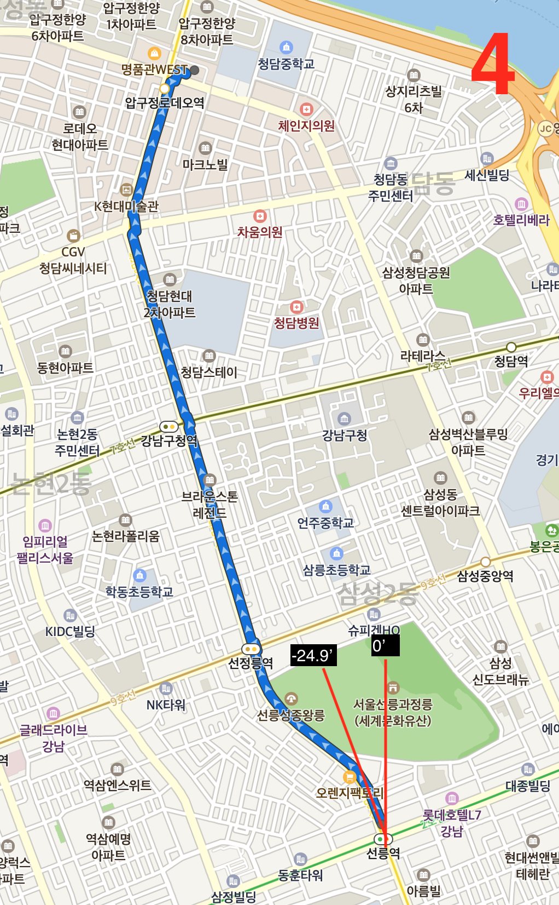

# Siverstar-API

Restful API Server for Silverstar

## Table of Contents

- [Table of Contents](#table-of-contents)
- [Notice](#notice)
- [API LIST](#api-list)
  - [Search](#search)
    - [Search destination](#search-destination)
    - [User search history](#user-search-history)
    - [Put search history](#put-search-history)
  - [Route](#route)
    - [Find Walk Rotue](#find-walk-rotue)
    - [Find Bus Rotue](#find-bus-rotue)
  - [Bookmarks](#bookmarks)
    - [Get Bookmarks](#get-bookmarks)
    - [Bookmark location](#bookmark-location)

## Notice

Please note that some variables are in **minutes** and some are in **seconds**.  
If the last track is disconnected, or if the distance is too far to be searched, a **500 error** is returned.

## API LIST

### Search

#### Search destination

> Search destination and put search history automatically

- Method: POST
- URL: /search/get
- Request Params
  - `float x`: Center longitude
  - `float y`: Center latitude
  - `string query`: Search Keyword
  - `boolean sort`
    - if 1: order by accuracy
    - if 0: order by distance
  - `string[16] deviceId`: Device ID
- Response Params

  - `float x`: longtitude
  - `float y`: latitude
  - `string name`: name of location
  - **[*]**`string address`

- Request Example

  ```text
  x: 127.06283102249932
  y: 37.514322572335935
  query: 서울시청
  sort: 1
  deviceId: 141252142
  ```

- Response Example

  ```json
  [
    {
      "x": "126.978656785931",
      "y": "37.5668260054857",
      "name": "서울특별시청",
      "addr": "서울 중구 세종대로 110"
    },
    {
      "x": "126.975655748641",
      "y": "37.5644395872256",
      "name": "서울특별시청 서소문청사",
      "addr": "서울 중구 덕수궁길 15"
    },
    {
      "x": "126.978742518872",
      "y": "37.5678531561768",
      "name": "서울특별시청 무교동청사",
      "addr": "서울 중구 무교로 21"
    },
    {
      "x": "126.978204092983",
      "y": "37.5665880598597",
      "name": "서울시청 시민청 태평홀",
      "addr": "서울 중구 세종대로 110"
    },
    {
      "x": "126.975646708937",
      "y": "37.5643927335562",
      "name": "서울특별시청 서소문청사 1동",
      "addr": "서울 중구 덕수궁길 15"
    },
    {
      "x": "126.974261240781",
      "y": "37.5645690349039",
      "name": "서울시청 별관후생동",
      "addr": "서울 중구 덕수궁길 15"
    },
    {
      "x": "126.974723027287",
      "y": "37.5646195904631",
      "name": "서울특별시청 서소문청사 서울시의회별관",
      "addr": "서울 중구 덕수궁길 15"
    },
    {
      "x": "126.978693000752",
      "y": "37.5668476359284",
      "name": "서울시청 본청사 주차장",
      "addr": "서울 중구 세종대로 110"
    },
    {
      "x": "126.978221551817",
      "y": "37.5688261365316",
      "name": "서울특별시청 청계청사",
      "addr": "서울 중구 청계천로 8"
    },
    {
      "x": "126.974809133312",
      "y": "37.564370933905",
      "name": "서울특별시청 서울시청별관2동",
      "addr": "서울 중구 덕수궁길 15"
    },
    {
      "x": "126.973174653239",
      "y": "37.5645435651232",
      "name": "서울중앙지방법원 중부등기소",
      "addr": "서울 중구 서소문로11길 34"
    },
    {
      "x": "126.975175855106",
      "y": "37.5643818235373",
      "name": "서울시청 서소문별관 주차장",
      "addr": "서울 중구 덕수궁길 15"
    },
    {
      "x": "126.992218180468",
      "y": "37.5556336945332",
      "name": "서울특별시청 남산청사",
      "addr": "서울 중구 삼일대로 231"
    },
    {
      "x": "126.977199342956",
      "y": "37.5653444955867",
      "name": "시청역 1호선",
      "addr": ""
    },
    {
      "x": "126.973790543874",
      "y": "37.5641076212639",
      "name": "서울시립미술관 서소문본관",
      "addr": "서울 중구 덕수궁길 61"
    }
  ]
  ```

#### User search history

- method: GET
- URL: /search/history/get2/`deviceId`
- Request Params
  - `string[16] deviceId`
- Response Params
  - `string query`
- Request Example
  `PROTOCOL://DOMAIN/search/history/get/fociencoxl1kdlsa`
- Response Example

  ```json
  [
    {
      "x": 127.051,
      "y": 37.5062,
      "query": "월드원무역",
      "address": "AA로 10",
      "created_at": "2019-07-20 13:22:13"
    }
  ]
  ```

#### Put search history

- Method: POST
- URL: /search/history/put
- Request Params
  - `string[16] uid`
  - `float x`
  - `float y`
  - `string name`: maximum 50 characters
  - `string address`
- Response Params

  - "1": success
  - "error": error

- Request Params

  ````text
  x: 127.0508443
  y: 37.5061825
  name: 월드원무역
  deviceId: da92d83b100cedb7
  address: AA로 10  ```
  ````

### Route

#### Find Walk Rotue

- method: POST
- URL: /route/walk/get
- Request Params
  - `float x1`: Current longitude
  - `float y1`: Current latitude
  - `float x2`: Destination longitude
  - `float y2`: Destination latitude
- Response Params

  - summary
    - `int distance`: total distance (m)
    - `int duration`: duration (second)
    - `int routeLength`: count of routes
  - route

    - `float x`: portion longtitude
    - `float y`: portion latitude
    - `float direction`: angle (sexadecimal system; please refer above screenshot)
    - `string description`: description about route
    - `int distance`: portion distacne (m)
    - `int duration`: portion duration (second)
    - `int pathLength`: count of path
    - `float[] pathX`, `float[] pathY`: coordinate to draw line

      > Note: pathX[n] and pathY[n] is coupled  
      > i.e.) draw pathX[0], pathY[0] and pathX[1], pathY[1], ... , pathX[n], pathY[n]

      ```java
        for(int i = 0; i < data['summary']['routeLength']; i++){
          // do something
          for (int j = 0; j < data['route'][i]['pathLength']; j++) {
            map.drawLine(pathY, pathX);
            // do something
          }
        }
      ```

- Request Example  
  

  > Current location: 선릉역 2호선  
  > Destination location: 갤러리아백화점 명품관 EAST

  ```json
  x1: 127.04899330000003
  y1: 37.504525000000015
  x2: 127.0418022
  y2: 37.52796560000001
  ```

- Response Example:
  [Json: Response Example](./route_get.json)

#### Find Bus Rotue

- method: POST
- URL: /route/walk/get
- Request Params
  - `float x1`: Current longitude
  - `float y1`: Current latitude
  - `float x2`: Destination longitude
  - `float y2`: Destination latitude
- Response Params

  - summary
    - `int distance`: total distance (m)
    - `int duration`: duration (min)
  - route

    - `string type`: "BUS" or "WALKING"

      - if `type == 'WALKING'`
        - route[]
          > Below is same with [Find Walk Rotue]
        - `float x`: portion longtitude
        - `float y`: portion latitude
        - `float direction`: angle (sexadecimal system; please refer above screenshot)
        - `string description`: description about route
        - `int distance`: portion distacne (m)
        - `int duration`: portion duration (second)
        - `int pathLength`: count of path
        - `float[] pathX`, `float[] pathY`: coordinate to draw line
      - else if `type == 'BUS'`

        - `string description`: Explanation of user behavior
        - `int distance`: distance (meter)
        - `int duration`: duration (mins)
        - `string busNumber`: bus number
        - `string busColor`: bus color (i.e. #ff0000)
        - `string busCongestion`: congestion of bus (여유, 혼잡, 정보 없음, ...)
        - `int remainingTime`: Time remaining until bus arrival (**second**)
        - `int pathLength`: count of path
        - `float[] pathX`, `float[] pathY`: coordinate to draw line
        - `int stationLength`: count of stations
        - `station[]`
          - `string id`: station id
          - `string name` : station name
          - ``

- Request Example

  ```json
  x1: 127.0099330000003
  y1: 37.504525000000015
  x2: 127.0418022
  y2: 37.52796560000001
  ```

- Response Example:
  [Json: Response Example](./route_bus_get.json)

#### Calculate direction between two coordinates

- method: POST
- URL: /route/direction
- Request Params
  - `float x1`: Current longitude
  - `float y1`: Current latitude
  - `float x2`: Destination longitude
  - `float y2`: Destination latitude
- Response
  - Bearing

### Bookmarks

#### Get Bookmarks

- method: GET
- URL: /bookmark/get/`deviceId`
- Request Params
  - `string[16] deviceId`
- Response Params
  - `string query`
- Request Example
  `PROTOCOL://DOMAIN/bookmark/get/fociencoxl1kdlsa`
- Response Example

  ```json
  [
    {
      "x": 127.051,
      "y": 37.5062,
      "name": "월드원무역",
      "address": "AA로 12",
      "created_at": "2019-07-20 13:24:56"
    }
  ]
  ```

#### Bookmark location

- method: POST
- URL: /bookmark/put
- Request Params
- `string[16] uid`
- `float x`
- `float y`
- `string name`: maximum 50 characters
- **[*]**`string address`
- Response Params
- "1": success
- "error": error
- Request Example

```text
x: 127.0508443
y: 37.5061825
name: 월드원무역
deviceId: da92d83b100cedb7
address: AA로 12
```

- Response Example

  ```text
  1
  ```
